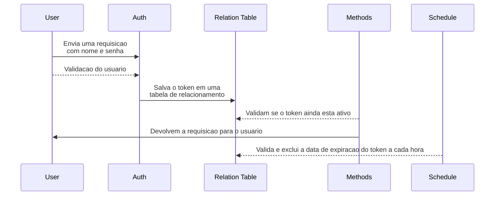

# ProductSoftexpertAPI

Logo abaixo vou mostrar um **passo a passo** de como **executar** este projeto, também vou explicar sua estrutura e peculiaridades.

O que será necessário para **executar** o projeto.
- Docker
- SGBD
	- **HOST**: postgresql
	- **NAME**: softexpert
	- **USER**: root
	- **PASS**: ase321
	- **PORT**: 5432

# Estrutura
## API (back-end)
    |-- .docker
    |   |-- nginx
    |   |-- php-fpm
    |   |-- postgresql
    |-- app
    |   |-- commands
    |   |-- config
    |   |-- controllers
    |   |-- routes
    |-- vendor
    |-- composer.json
    |-- docker-compose.yml
    |-- index.php
    |-- Makefile
    
## Front-end
Eu utilizei **ReactJs** e **NextJs**, segui a estrutura padrão dos frameworks.

# Docker

Tomei a liberdade de criar o ambiente todo em **docker**, um pouco diferente do solicitado. Fiz isso pois acredito que demonstre domínio sobre uma ferramenta muito importante sobre uma ferramenta relevante para a vaga.

## Bibliotecas e recursos
### Composer
Utilizei esse gerenciador de pacotes para baixar o autoload
### Autoload
Utilizei para carregar automaticamente classes e interfaces.
### PDO
Utilizei para facilitar a interação com os CRUDs do banco de dados

## Makefile
Trabalhei com um arquivo makefile para facilitar e estruturar os comandos que serão executados.
### Start Project
    make up
    make install
    
### Stop Project
    make stop
    
### Connect containers
    make php
    make nginx
    
### Alternatives commands

    make cache-clear
    make autoload
    make update
    
# Banco de dados
Tomei a liberdade de criado via **docker**, deixando mais interativa configuração. Segui instruções para **criar** e **atualizar** do **banco de dados** seguindo a metodologia de **migrates** do laravel, acredito que seja bem adequada, ordenada e organizada.

|    Table       |Column                         |Type                         		  |
|----------------|-------------------------------|------------------------------------|
|user			 | id                            |SERIAL  PRIMARY KEY   	          |
|-				 |username            			 |VARCHAR(50) NOT NULL		          |
|-				 |email							 |VARCHAR(100) NOT NULL				  |
|-				 |password						 |VARCHAR(255) NOT NULL				  |
|-				 |created_At					 |TIMESTAMP  DEFAULT CURRENT_TIMESTAMP|
___
|    Table       |Column                         |Type                         		  |
|----------------|-------------------------------|------------------------------------|
|tokens			 | id                            |SERIAL  PRIMARY KEY   	          |
|-				 |user_id            			 |INT  NOT NULL				          |
|-				 |token							 |VARCHAR(255) NOT NULL				  |
|-				 |expiration					 |TIMESTAMP  NOT NULL				  |
___
|    Table       |Column                         |Type                         		  |
|----------------|-------------------------------|------------------------------------|
|product		 | id                            |SERIAL  PRIMARY KEY   	          |
|-				 |name	            			 |VARCHAR(255)				          |
|-				 |description					 |TEXT								  |
|-				 |price							 |DECIMAL(10, 2)					  |
|-				 |qtd							 |INTEGER							  |
|-				 |created_At					 |TIMESTAMP  DEFAULT CURRENT_TIMESTAMP|
___
|    Table       |Column                         |Type                         		  |
|----------------|-------------------------------|------------------------------------|
|product type	 | id                            |SERIAL  PRIMARY KEY   	          |
|-				 |name	            			 |VARCHAR(255)				          |
|-				 |description					 |TEXT								  |
|-				 |percentage					 |INTEGER							  |
|-				 |created_At					 |TIMESTAMP  DEFAULT CURRENT_TIMESTAMP|
___
|    Table       |Column                         |Type                         		  |
|----------------|-------------------------------|------------------------------------|
|product type rel|product_id           			 |INTEGER  REFERENCES products(id)    |
|-				 |product_type_id			     |INTEGER  REFERENCES products_type(id)|
|-				 |created_At					 |TIMESTAMP  DEFAULT CURRENT_TIMESTAMP|

# Autenticação 
Criei um sistema semelhante a JWT, porem não usei nenhuma biblioteca.
Consiste em uma sequencia de metodos:
- Valida a autenticação pelo email e senha
- Gera um **bearer token** e salva em uma tabela de relacionamento
- Os métodos verificam se o usuário esta autenticado pelo **token**
- Possui uma **Schedule** no banco de dados para excluir o **token** a cara 4 horas, essa **Schedule** executa a cada hora.

